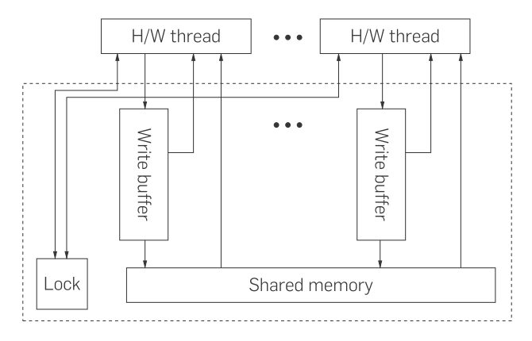

:author: Aleksei Shepliakov
:description: Mutual exclusion algorithms and implementation

.. title:: Mutex internals, part 1

----

Synopsis
========

Part 1
------

#. Classical mutual exclusion algorithms

    - `Peterson's algorithm`_
    - `Lamport's bakery algorithm`_

#. How (not so) modern hardware spoiled them
   
   - `3 peculiarities of modern CPUs`_
   - `Memory models`_
   - `Reconsidering Peterson's algorithm`_
   - `Memory barriers and atomic instructions`_
   - `TSO-correct implementation of Peterson's algorithm`_
   - `Reconsidering Lamport's algorithm`_

Part 2
------

#. `TL;DR version of part 1`_

#. Modern implementations

   - `Mutex versus spinlock`_
   - `Linux: compare-and-swap + sys_futex`_

Part 3
------

#. Introduction to lockless data structures and algorithms

   - Lockless singly linked list

----

Peterson's algorithm
====================

Mutual exclusion for two threads/processes

.. code:: C

  struct peterson_spinlock {
    volatile int wants_to_enter[2];
    volatile int looser;
  };

  void peterson_lock(struct peterson_spinlock *l, int id) {
    int other = 1 - id;
    l->wants_to_enter[id] = 1;
    l->looser = id;
    while (l->wants_to_enter[other] && (l->looser == id)) { }
  }

  void peterson_unlock(struct peterson_spinlock *l, int id) {
    l->wants_to_enter[id] = 0;
  }

The above code guarantees 

- mutual exclusion: only one thread can enter the critical section
- progress: if both threads wish to enter the critical sections one
  of them will eventually succeed (and another one will fail)
- liveness: all threads trying to enter the criticall section will
  eventually succeed

provided that the stores are atomic and instantaneous.

Proof
-----

Assume both processors have entered the critical section.
P0 has entered at cycle C0, P1 at C4, respectively, and C0 < C4.

C0: ``wte[1] == 0 || looser == 1``, and ``wte[0] == 1``

C4: ``wte[0] == 0 || looser == 0``, and ``wte[1] == 1``

``wte[0](C4) == 1`` => ``looser(C4) == 0``.

Only P0 assigns ``looser = 0``, and does so *before* entering. =>
``wte[1](C0) == 0``. Since ``wte[1](C4) == 1``, it must have been 
assigned *after* C0 (and before C4). However after assigning
``wte[1] = 1`` P1 assigns ``looser = 1`` (say, at cycle C3,
C0 < C3 < C4), and P0 does *not* tuch ``looser`` after C0.
Therefore ``looser(C4) == 1``, and ``wte[0](C4) == 1``, so P1 could
not have entered the critical section at C4.

Experiment
----------

.. code:: CXX

  static volatile int flag = -1;
  static volatile int error_count = 0;
  static peterson_spinlock flag_lock = {};

  static void run(int id, int iterations) {
    using now = std::chrono::high_resolution_clock::now;
    for (int i = 0; i < iterations; i++) {
      peterson_lock(&flag_lock, id);
      flag = id;
      auto end = now() + std::chrono::microseconds(1);
      do {
        if (flag != id) {
          error_count++;
        }
      } while (now() < end);
      peterson_unlock(&flag_lock, id);
    }
  }

  int main(int argc, char **argv) {
    int iterations = 20*1000*1000;
    std::thread t0{run, 0, iterations};
    std::thread t1{run, 1, iterations};
    t0.join();
    t1.join();
    if (error_count != 0) {
      std::printf("iterations: %d, errors: %d\n", iterations, error_count);
      return 1;
    } else {
      return 0;
    }
  }

----

Lamport's bakery algorithm
==========================

Mutual exclusion for *N* threads/processes

.. code:: C

  static int choosing[N];
  static int number[N];

  void enter(int id) {
      choosing[id] = 1;
      number[id] = 1 + max(number, N);
      choosing[id] = 0;

      for (int j = 0; j < N; j++) {
          while (choosing[j]) { /* wait */ }
          while ((number[j] != 0) &&
                 (number[j] < number[id]) ||
                  ((numbder[j] == number[id]) && j < id)) { /* wait */ }
      }
  }

  void leave(int id) {
      number[id] = 0;
  }

----

3 peculiarities of modern CPUs
==============================

- `Out of order execution`_
- Implicit parallelism: `superscalar execution`_, `pipelining`_
- `Memory caches and reordering`_

Out of order execution
----------------------

The order of the machine instructions in the program in general does not
match the order in which CPU executes them.
The CPU can execute code in advance (i.e. before control reaches that
code) if/when both

- the necessary data is available
- there are idle execution units 

(known as `speculative execution`_)

.. _speculative execution: https://en.wikipedia.org/wiki/Speculative_execution

Superscalar execution
---------------------

CPU can execute several instruction in the same cycle by scheduling them to different
execution units (ALU, FPU, etc).

----

Pipelining
----------

Instruction is divided (pipelined) into a series of sequential steps (stages),
with different stages of instructions processed in parallel. For instance,
these steps can be (known as the *classic RISC pipeline*)

#. Instruction fetch
#. Instruction decode and register fetch
#. Execute
#. Memory access
#. Register writeback

and a CPU can fetch next instruction when another one is being executed.

These days even simple 8-bit microcontrollers are pipelined (say, `Atmel AVR`_
have two-stage pipelines), and x86 CPUs have a long 30-stage pipeline.

Consequences:

- Higher CPU throughput as long as pipeline is mostly busy
- Instruction execution is in general not atomic
- Lots of mispredicted branches, context switches, heavy debugging/instrumentation
  cause pipeline stalls (and can make CPU run slower than a non-pipelined one)

.. _Atmel AVR: https://en.wikipedia.org/wiki/AVR_microcontrollers

----

Memory caches and reordering
----------------------------

- `DRAM`_ is way too slow for CPUs
- `SRAM`_ is way expensive

Solution: introduce cache which contains a copy of data from frequently
referenced memory addresses. Usually caches are implemented as a hierarchy
of multiple layers.

To keep up with CPUs caches are spitted into (almost) independent *banks*
which can operate in parallel. However such cache can reorder memory operations!

+------------------+-----------------+
|       CPU 0      |      CPU 1      | 
+=========+========+========+========+
|  Bank 0 | Bank 1 | Bank 0 | Bank 1 |
+---------+--------+--------+--------+
|         L2 cache (shared)          |
+------------------------------------+

(actual CPUs are much more complicated, see `AMD's memory architecture`_)

- CPU issues loads/stores in a certain (execution) order
- However the memory system is **not** obliged to execute these loads/stores
  in the execution order

Wait a minute, what's the execution order?

- program order: the order in which memory operations are specified
  in the (machine) code. Differs from the (memory operations) order
  in the source code due to the compiler optimizations.
- execution order: the order in which the individual memory-reference
  instructions are executed on a given CPU. Differs from the program
  order due to out of order execution.
- observed order: the order in which a given CPU observes its and other
  CPUs' memory operations. Differs from the execution order due to caching
  and other memory system optimizations (say, write buffers).

.. _AMD's memory architecture: https://www.realworldtech.com/bulldozer/3
.. _SRAM: https://en.wikipedia.org/wiki/Static_random-access_memory
.. _DRAM: https://en.wikipedia.org/wiki/Dynamic_random-access_memory

----

Memory models
=============

- `Strict consistency`_
- `Sequential consistency`_
- `Processor consistency`_
- `Relaxed memory models`_

A set of rules of memory operations reordering is called **memory model**.
Each architecture has its own memory model.

----

Strict consistency
------------------

Read from a location returns the value of the last write to that location according
to a global clock. In other words, any stores are instantaneously observed by all
CPUs in the same order.

Real world examples: none I know of (except 8-bit microcontrollers)

Sequential consistency
----------------------

Memory operations of all CPUs appear to be executed sequentially in *some* order.
Operations of each CPU appear in this sequence in the execution order of that CPU.

Real world examples: `MIPS R10000`_

.. _MIPS R10000: https://en.wikipedia.org/wiki/R10000

----

Total store ordering
--------------------

Stores of all CPUs appear to be executed by memory sequentially in *some* order.
Furthermore, the sequence of stores in the memory order for a given processor is
identical to the execution order.

In other words

* Processor can read *B* before its own write to *A* completes
* Read by other processors cannot return the new value of *A* until the write
  to *A* is observed by **all** processors 

Motivation: allow store buffers so the cache can perform reads while the write
is taking place.

Real world examples: `SPARC v8`_ and x86_64 have a very similar memory model
(although the documentation is a bit ambiguous).

.. _SPARC v8: https://www.gaisler.com/doc/sparcv8.pdf

X86-TSO
-------

The memory model of actual x86 CPUs is subtly different

.. _Sewell2010: https://www.cl.cam.ac.uk/~pes20/weakmemory/cacm.pdf

----

Processor consistency
---------------------

Stores by a particular CPU are observed by all other CPUs in the same order
(yet it does not require stores from *all* CPUs to be observed in the same order).
Sort of relaxed TSO, in the sense that allows a CPU to observe a store
*before* the same store is observed by other CPUs.

Motivation:

* Reordering makes it possible to execute more operations in parallel
* When a thread manipulates its private data, other threads don't care
  when exactly they observe the corresponding stores. On the other
  hand manipulating shared data requires an explicit ordering anyway.

Relaxed memory models
---------------------

Memory system can perform any reordering unless ordering is explicitly forced
by *memory barrier* instructions.

Motivation: even higher memory throughput and/or a simpler hardware

Real world examples: `IBM POWER`_, `ARM`_

.. _IBM POWER: https://en.wikipedia.org/wiki/POWER8
.. _ARM: https://en.wikipedia.org/wiki/ARM_architecture

----

Reconsidering Peterson's algorithm
==================================

Assume the architecture uses TSO memory model (which is *approximately*
the memory model of x86_64). According to this model it's OK to reorder
a store and a load to/from the *same* address done by different CPUs.

+-----------------------------------+-----------------------------------+-------------------+
|               CPU 0               |     CPU 1                         |                   |
+===================================+===================================+===================+
| S00: wants_to_enter[0] = 1        | S10: wants_to_enter[1] = 1        |      buffered     |
+--------------+--------------------+-----------------------------------+-------------------+
| S01: looser = 0                   | S11: looser = 1                   |      buffered     |
+-----------------------------------+-----------------------------------+-------------------+
| L00: r1 = wants_to_enter[1]       | L10: r1 = wants_to_enter[0]       | both CPUs read 0  |
+-----------------------------------+-----------------------------------+-------------------+
| L01: r2 = looser                  | L11: r2 = looser                  |      (0, 1)       |
+-----------------------------------+-----------------------------------+-------------------+
| if (r1 == 1 && r2 == 0): goto L00 | if (r1 == 1 && r2 == 1): goto L10 |   both enter      |
+-----------------------------------+-----------------------------------+-------------------+

Note: such execution is impossible under the sequential consistency.
There's a global order in which memory executes all operations (both loads
and stores). Assume that both *L00 < S10* and *L10 < S00* (so both CPUs
have read the obsolete values of *wants_to_enter*).
*S10 < L10* (since sequential consistency preserves the program order of CPU 1),
*L00 < S10* (by assumption) => ergo in the global order *L00 < S10 < L10*
*S00 < L00* (since sequential consistency preserves the program order of CPU 0),
thus *S00 < L00 < S10 < L10*, thus *L10* can't happen before *S00*.

----

Memory barriers and atomic instructions
=======================================

Memory barriers (fences)
------------------------

Sometimes one need to enforce a particular order of memory operations.
CPUs provide special instructions for this.

x86: *mfence*

Every load and store which preceeds the *mfence* instruction (in the program order)
becomes globally visible before any load and stores that follow the *mfence* insn.

-----

Atomic instructions
-------------------

Either succeeds in completing the operation with no interruptions or fails
to even begin the operation (say, because another CPU got an exclusive access
to the same cache line)

Common example: compare_and_swap(old, new, addr). Equivalent to

.. code:: C

  temp = *addr;
  if (temp == old) {
      *addr = new;
  } else {
      old = temp; /* to know if it succeed or failed */
  }

(except for atomicity)

x86:

.. code:: asm

  lock cmpxchg

*cmpxchg* does compare and swap
*lock* prefix acquires exclusive cache access and acts as a memory barrier

----

TSO-correct implementation of Peterson's algorithm
==================================================

.. code:: C

  volatile int flag[2] = { 0, 0 };
  volatile int looser = 0;

  void enter(int id) {
      int other = 1 - id;
      flag[id] = 1;
      looser = id;
      asm volatile("mfence" ::: "memory");
      while (flag[other] && (looser == id)) { }
  }

  void leave(int id) {
      flag[id] = 0;
  }

Note on performance
-------------------

In order to perform the store the CPU must acquire the exclusive access to
the cache line. On x86 the whole *wants_to_enter* array fits into a single
cache line, hence CPUs are going to fight for that cache line (the problem
is known as `false sharing`_). Same applies to writing the *looser* variable.
Thus the straightforward implementation of Peterson's algorithm is wrong,
and the correct one is suboptimal.

----

Reconsidering Lamport's algorithm
=================================

* Correct with sequential consistency and breaks with other memory models
* Requires several memory fences to operate correctly
* Poor performance due to the `false sharing`_

.. _false sharing: https://en.wikipedia.org/wiki/False_sharing

----

TL;DR version of part 1
=======================

* Humans assume memory operations to occur in a certain order, presumably
  in the same order as in the (machine code) program.

* In reality the memory system (write buffers + caches + NUMA interconnets)
  does **NOT** execute loads and stores in the program order and is free
  to reorder them subject to certain set of invariants (called *memory model*).

* One of the most widespread memory models is *Total Store Order* (TSO):
  all CPUs observe stores in the same order (and stores of a specific CPU
  occur according to its program order). In other words, load can be moved
  ahead of store (to a different address).

* With TSO this program

  +--------------------+------------------+
  |      CPU 0         |        CPU 1     |
  +====================+==================+
  |     X = 1          |      Y = 1       |
  +--------------------+------------------+
  |     r0 = Y         |      r1 = X      |
  +--------------------+------------------+

  (assuming initially X == Y == 0) can result in r0 == r1 == 0.

* Such reordering breaks classical mutual exclusion algorithms (Lamport, Peterson, etc).
* To force the memory ordering CPUs provide special instructions memory
  barriers and atomic instructions

----

Mutex versus spinlock
=====================

Both mutexes and splinlocks guarantee mutual exclusion. However mutex
cooperates with the operating system and 

- suspends the calling thread if it failed to enter the critical section
- wakes the calling thread up when it makes sense to retry entering

Thus the algorithms discussed so far are not mutexes. They are (broken)
spinlocks.

Unfair spinlock
===============

.. code:: C

  void lock(int* lock) {
       while (__sync_compare_and_swap(lock, 0, 1) == 0) { }
  }

  void unlock(int* lock) {
       *lock = 0;
  }

* Simple and correct
* **NOT** fair: the CPU which has just released a lock has an advantage to
  quickly reacquire the lock (since the CPU owns the cache line)
* Unfairness is extremely noticable with NUMA (for instance 2-, 4-socket x86_64 CPUs)
  (some threads are starved or "unfairly" granted lock up to 10^6 times)

A (more) fair implementation will be considered later on (during/after
the discussion of lockless data structures)

----

Linux: compare-and-swap + sys_futex
===================================

What's sys_futex?
-----------------

.. code:: C

  int futex(int* uaddr, int op, int val1,
            const struct timespec* timeout,
            int* uaddr2, int val3);

* FUTEX_WAIT causes the calling thread to be suspended in the kernel until
  notified (presumably by FUTEX_WAKE). Before suspending the thread the value
  at address `uaddr` is checked. If it is **not** the same as the `val1`
  parameter the system call returns immediately with the `EWOULDBLOCK` error.
  If the `timeout` parameter is not NULL, the calling thread suspended only
  for a limited time. If the time runs out without a notification being sent
  the system call returns with the `ETIMEDOUT` error.

* FUTEX_WAKE wakes up one or more threads waiting on the futex. Only `uaddr`,
  `op`, and `val1` parameters are used. The value of `val1` specifies the number
  of threads the caller wants to wake. The return value is the number of threads
  which have been queued and have been woken up.

----

Mutual exclusion based on sys_futex, take 1
-------------------------------------------

.. code:: C

   void broken_mutex_lock(int* mutex) {
     int c;
     while ((c = __sync_fetch_and_add(mutex, 1)) != 0) {
       syscall(SYS_futex, mutex, FUTEX_WAIT, c + 1, NULL, NULL, 0);
     }
   }

   void broken_mutex_unlock(int* mutex) {
     *mutex = 0; //*
     syscall(SYS_futex, mutex, FUTEX_WAKE, 1, NULL, NULL, 0);
   }

Problems
--------

The algorithm guarantees mutual exclusion. But what about progress?

Livelock
~~~~~~~~

+---------------------------+----------------------------+--------------+
|  thread 0                 |    thread 1                |  mutex value |
+===========================+============================+==============+
| atomic_inc                |  [pre-emptied]             |       1      |
+---------------------------+----------------------------+--------------+
| [pre-emptied]             |  atomic_inc                |       2      |
+---------------------------+----------------------------+--------------+
| futex_wait(1) EWOULDBLOCK |  [pre-emptied]             |       2      |
+---------------------------+----------------------------+--------------+
| atomic_inc                |  futex_wait(2) EWOULDBLOCK |       3      |
+---------------------------+----------------------------+--------------+
| [pre-emptied]             |  atomic_inc                |       4      |
+---------------------------+----------------------------+--------------+
| futex_wait(2) EWOULDBLOCK |  [pre-emptied]             |       4      |
+---------------------------+----------------------------+--------------+
| atomic_inc                |  futex_wait(4)             |       5      |
+---------------------------+----------------------------+--------------+

Both threads can contend this way forever. That's a `live lock`_.

.. _live lock: https://en.wikipedia.org/wiki/Deadlock#Livelock

----

Mutual exclusion based on sys_futex, take 2
-------------------------------------------

.. code:: C

  void enter(int *mutex) {
      int c;
      if ((c == __sync_val_compare_and_swap(mutex, 0, 1)) != 0 /* A0 */) {
          // somebody tries to lock the mutex (or has already locked it),
          // add the calling thread to the wait queue
          do {
             if (c == 2 // there are threads waiting for a mutex (perhaps)
                 || __sync_val_compare_and_swap(mutex, 1, 2) != 0 /* A1 */
                 // otherwise mark the mutex as having waiters, ...
                ) {
                   // ... add the calling thread to the wait queue, and wait
                   syscall(SYS_futex, mutex, FUTEX_WAIT, 2, NULL, NULL, 0);
              } else {
                  // compare-and-swap at A1 returned 0. Perhaps the other
                  // thread has unlocked the mutex. Try to grab the mutex
                  // once again immediately (without waiting in the kernel).
                  // Unfortunately we can't just proceed to the critical
                  // section since the mutex hasn't been marked as locked.
             }
          } while (
              // Try to lock once again. The control reaches here either
              // when the kernel has woken up the calling thread, or we've
              // decided to skip waiting in the kernel. In both cases there
              // might be other threads waiting for this mutex. This "might be"
              // is a bit irritating, but it's better to be safe than sorry.
              (c = __synv_val_compare_and_swap(mutex, 0, 2)) != 0 /* A2 */);
      } else {
          // uncontested: locked with a single instruction
      }
  }

  void leave(int *mutex) {
      if (__sync_fetch_and_sub(mutex, 1) != 1) {
          // there might be threads waiting for the mutex
          *mutex = 0;
          // Wake up a single thread to avoid multiple CPUs fighting
          // for the same cache line. Also only one of those threads
          // will be able to acquire the mutex anyway.
          syscall(SYS_futex, mutex, FUTEX_WAKE, 1, NULL, NULL, 0);
      }
  }

----

Sketch of sys_futex implementation
==================================

* The kernel uses the physical address of the futex as its identifier
* Futexes and threads waiting for them are maintained as a hash table
* This hash table is protected by a spinlock

FUTEX_WAIT
----------

.. code:: C

  int futex(int* uaddr, int op, int val1,
            const struct timespec* timeout,
            int* uaddr2, int val3);

* Marks the calling thread as interruptible and places it to
  the `futex_queues` hash table.
* Maps the page containing the futex (passed as a virtual address
  `uaddr`) and checks if the current futex value matches `val1`
* If not, set error to EWOULDBLOCK
* Otherwise sleep for the time inidicated by the `timeout` argument,
  or indefinitely if it's NULL
* On timeout set error to ETIMEDOUT, otherwise set error to EINTR if
  there is a signal pending
* Try to remove the calling thread from the `futex_queues`, if already
  removed return 0 (success) uncoditionally (means the thread was waken
  up), otherwise return the error set above

FUTEX_WAKE
----------

* Finds threads waiting for the specified futex, wakes at most `val1` of them

----

Links
=====

* `A primer on memory consistency and cache coherence`_ by Daniel J. Sorin, Mark D. Hill, David A. Wood
* `A new solution of Dijkstra's concurrent programming problem`_ by Leslie Lamport
* `A tutorial introduction to the ARM and POWER relaxed memory models`_ by Luc Maranget, Susmit Sarkar, Peter Sewell
* `Fuss, futexes, and furwlocks: fast user level locking in Linux`_ by Hubertus Franke, Rusty Russel
* `Futexes are tricky`_ by Ulrich Drepper

.. _A primer on memory consistency and cache coherence: https://dl.acm.org/citation.cfm?id=2028905
.. _A new solution of Dijkstra's concurrent programming problem: http://lamport.azurewebsites.net/pubs/bakery.pdf
.. _A tutorial introduction to the ARM and POWER relaxed memory models: https://www.cl.cam.ac.uk/~pes20/ppc-supplemental/test7.pdf
.. _`Fuss, futexes, and furwlocks: fast user level locking in Linux`: https://www.kernel.org/doc/ols/2002/ols2002-pages-479-495.pdf
.. _Futexes are tricky: https://www.akkadia.org/drepper/futex.pdf
